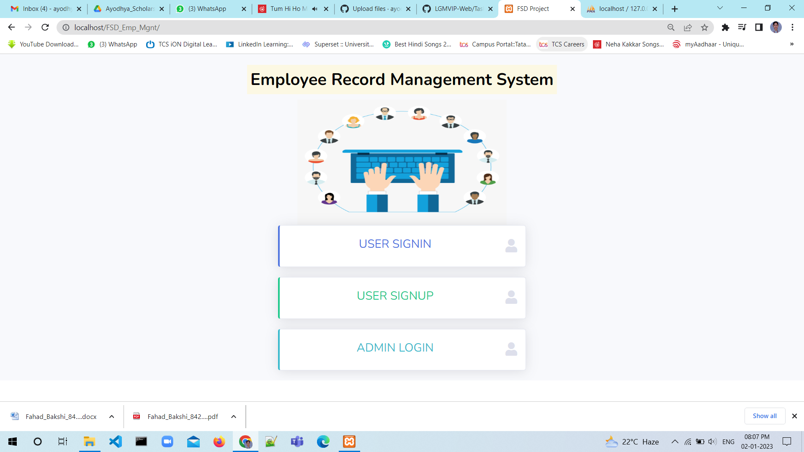
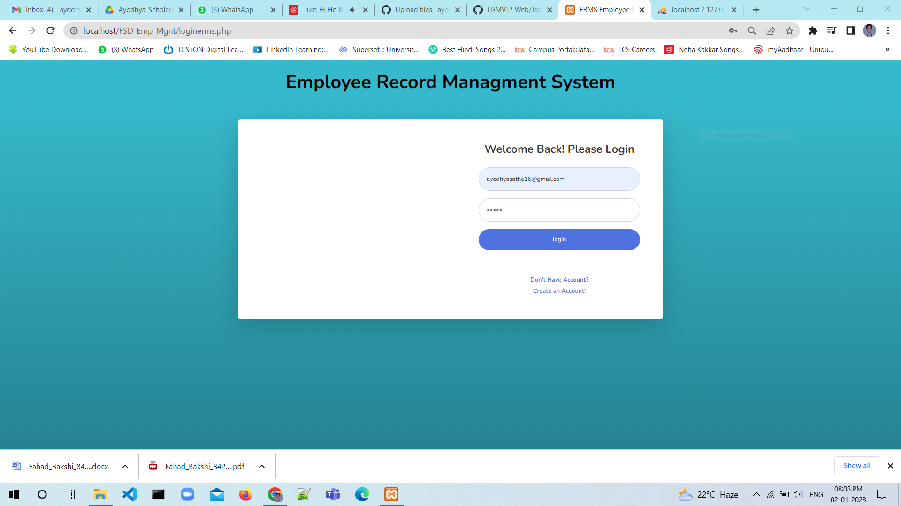
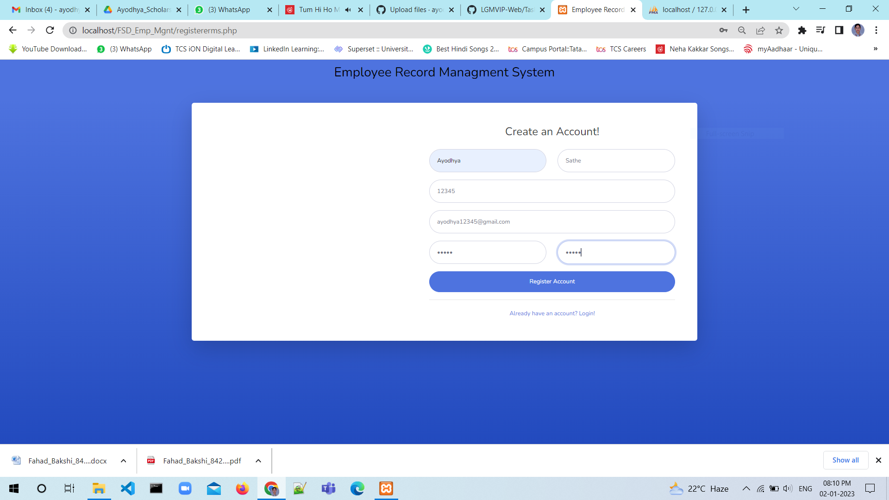
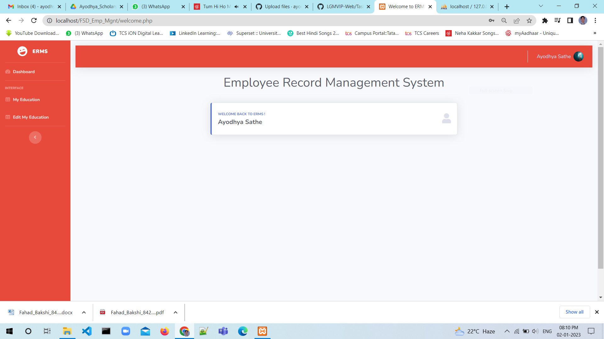
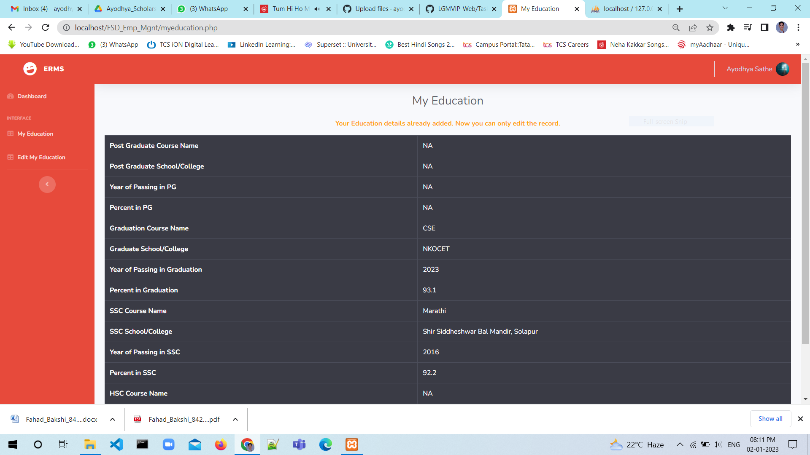
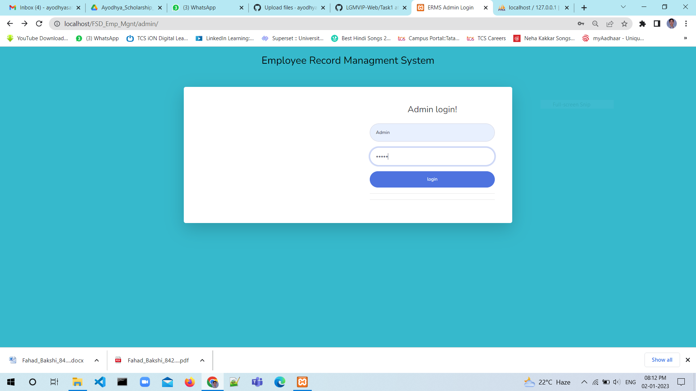
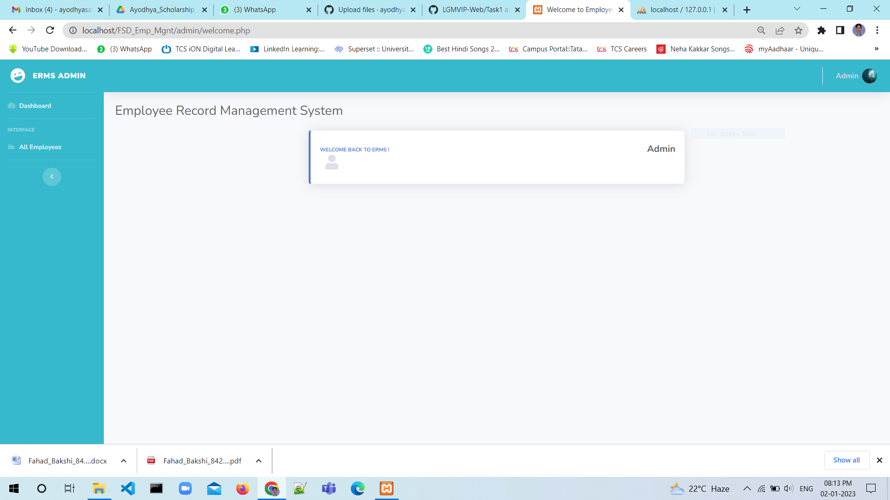
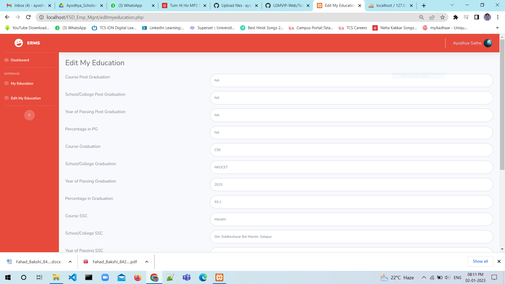
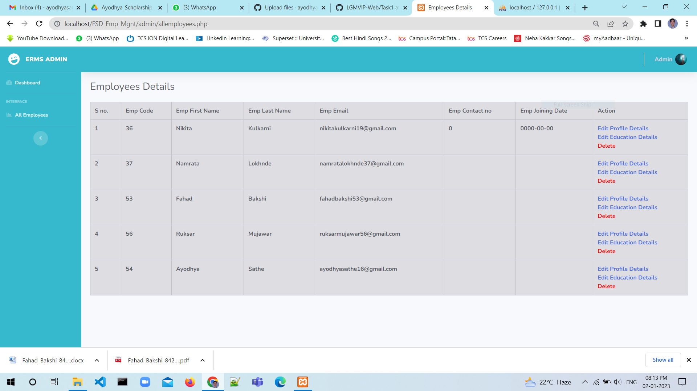
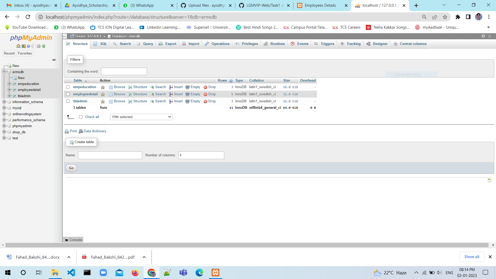

#<h1><b>Employee-Record-Management-System</b> <h1>
  

<b>Tech Stack:<b> HTML, CSS and Javascript, PHP.  
<b>Code Editor:<b> Visual Studio Code   
<b>Index Page</b>  

<b>Employee Login Page</b>    

<b>Employee Registration Page</b>    

<b>Home Page</b>  

<b> My Education Page</b>  

<b>Admin Login Page</b>    

<b>Admin Home Page</b>    

<b>Edit Education Page</b>    

<b>All Emp Details Page</b>    

<b>Database </b>    

